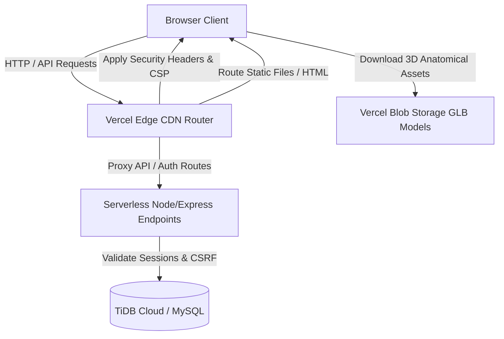

# BioVerse X — Immersive Human Anatomy Education

[](https://github.com/darshu-22/Bio-verse)
[](https://bio-verse-black.vercel.app)
[](#)
[](#)
[](#)
[](#)
[](#)
[](#)

BioVerse X is a commercial-grade, immersive digital anatomy learning platform designed for schools, students, and educators. It integrates high-fidelity interactive 3D anatomy rendering with hand-gesture camera controls and a robust educational management portal, secured under state-of-the-art web application vulnerability protections.

---

## 🔗 Project Links

*   **Live Demo:** [https://bio-verse-black.vercel.app](https://bio-verse-black.vercel.app)
*   **GitHub Repository:** [https://github.com/darshu-22/Bio-verse](https://github.com/darshu-22/Bio-verse)

---

## ✨ Implemented Features

### 🌐 Interactive 3D Human Anatomy Explorer
*   Full 3D WebGL-based visualization of skeletal, muscular, nervous, circulatory, digestive, and respiratory organ systems.
*   Interactive clicking, highlighting, and stats panel details mapping scientific name, location, common diseases, and related anatomical structures.
*   Custom camera orientation controls, pivot points, and zooming controls.

### ✋ Camera-Based Gesture Interaction
*   Real-time touchless gesture control using the device's web camera, powered by Google MediaPipe.
*   Index finger pointing for virtual cursor tracking, pinching gestures for selections/clicks, and multi-finger waves for camera resets.
*   Integrated calibration interface to dynamically offset camera capture sizes.

### 📚 Teacher & Student Roster Portals
*   **Teacher Dashboard:** Roster creation, scheduling classes, assignment creation, student average progress reports, and live quiz tracking charts.
*   **Student Dashboard:** System learning progress visualization, assignments workflow completions, quiz statistics logs, and gamified experience points (XP) badge tracking.

### 🎨 Premium Glassmorphism UI
*   Modern dark-mode aesthetic with custom animations, custom Google Fonts, responsive layouts, sidebar navigations, and glassmorphic panels.

---

## 🔒 Implemented Security Protections

BioVerse X is built under a **strict Zero-Trust security layout**, featuring multiple defensive layers implemented across successive security auditing phases:

*   **Secure Authentication:** Salted password hashing via industry-standard `bcrypt`.
*   **Hardened Session Management:** Persistent sessions backed by `express-mysql-session` with randomized secure session IDs (`bvx.sid`).
*   **Secure Cookies:** Production cookies configured with `HttpOnly`, `SameSite=Lax`, and `Secure` attributes to block cross-site leakage and script accessibility.
*   **Fail-Closed Database Design:** Absolute server protection in production. All DB transactions fail-closed instantly if connection issues arise, preventing diagnostic leaks or local fakes.
*   **Distributed Rate Limiting:** Enforces maximum request limits per IP, signup accounts, and signin requests. Stores failure records in the database with automatic recovery windows.
*   **Body Shape Validation & Whitelists:** JSON content-type bounds and schema checks validate client requests, blocking prototype pollution, oversized uploads, and boundary bypasses.
*   **CSRF & Origin Protection:** Rejects cross-origin POST/PUT/PATCH/DELETE requests by analyzing `Origin` and `Fetch Metadata` request headers against an authorized Vercel source domain (`APP_ORIGIN`).
*   **Content Security Policy (CSP):** Restricts script executions to verified CDN origins (`self`, cdnjs, jsDelivr), permits WebAssembly compilation (`'wasm-unsafe-eval'`), blocks iframes, and upgrades insecure requests.
*   **Stored XSS Defenses:** Client-side local database items (student names, class names, assignments) are fully sanitized using an HTML escaping utility before rendering into `innerHTML` elements.
*   **Secure Production Headers:** Express-level headers disable `X-Powered-By`, and Vercel Edge-level headers enforce HSTS, X-Content-Type-Options (`nosniff`), X-Frame-Options (`DENY`), and Referrer-Policy.

---

## 🛠️ Technology Stack

| Component | Technology | Description |
| :--- | :--- | :--- |
| **Frontend UI** | HTML5, Vanilla CSS, JS (ES6) | Responsive, high-performance visual layer with custom CSS animations. |
| **3D Rendering** | Three.js | WebGL-based engine serving anatomical structure loaders (`GLTFLoader`). |
| **Computer Vision** | Google MediaPipe Hands | Computer vision pipeline tracking finger landmarks on camera streams. |
| **Model Hosting** | Vercel Blob | CDNs hosting high-fidelity anatomical 3D GLB model binaries. |
| **Backend Server** | Node.js, Express | API endpoints, session routing, and authentication handler server. |
| **Local Database** | LocalStorage / MockDB | Local educational portal persistence layer. |
| **Prod Database** | TiDB Cloud (MySQL) | Cloud-scale relational database backend. |
| **Deployment** | Vercel | Production CDN edge routers and serverless server execution. |

---

## 📐 Project Architecture



---

## 📂 Folder Structure

```
Bioverse/
├── css/                   # Global style sheets (layout, typography, variables)
├── data/                  # Static manifest details mapping anatomical components
├── js/                    # Client-side javascript engines (Root duplicate)
│   ├── school-platform.js # Local portal management (Teachers/Students)
│   └── ...
├── models/                # Static model assets and skeletons
├── public/                # Vercel static distribution directory
│   ├── css/
│   ├── js/                # Active production client-side scripts
│   │   ├── school-platform.js
│   │   └── ...
│   └── index.html         # Immersive Single-Page Application Entry point
├── scratch/               # Testing suites, header validators, and XSS mock specs
├── server.js              # Node.js/Express application configuration
├── vercel.json            # Vercel deployment, edge routing, and CSP configurations
├── package.json           # Server configuration dependencies
└── README.md              # Project Documentation
```

---

## ⚙️ Installation & Setup

### Prerequisites
*   Node.js (v18 or higher)
*   A local MySQL server or cloud TiDB Cloud database instance

### 1. Clone the Repository
```bash
git clone https://github.com/darshu-22/Bio-verse.git
cd Bio-verse
```

### 2. Install Dependencies
```bash
npm install
```

### 3. Setup Environment Variables
Create a `.env` file in the root directory based on `.env.example`:
```ini
NODE_ENV=development
PORT=8000
SESSION_SECRET=your_development_session_secret
RATE_LIMIT_SECRET=your_development_rate_limit_secret
APP_ORIGIN=http://localhost:8000

# Database Configuration (MySQL / TiDB)
DB_HOST=127.0.0.1
DB_PORT=3306
DB_USER=root
DB_PASSWORD=your_mysql_password
DB_NAME=bioverse
DB_SSL=false
```

---

## 🚀 Running Locally

To run the application locally in development mode:

```bash
# Starts the backend server
node server.js
```

Open [http://localhost:8000](http://localhost:8000) in your web browser.

---

## 🔮 Future Enhancements

*   **Dynamic Classroom API integration:** Shift the local local-storage portal database into SQL schemas to synchronise teacher rosters across multiple live platforms.
*   **Multiplayer Anatomy Rooms:** Synchronous classroom learning where teachers direct 3D structures in real time across student screens.
*   **Virtual Reality (VR) Support:** Implement WebXR layers to explore models inside VR headsets.

---

## 📄 License
This project is licensed under the MIT License - see the LICENSE file for details.

---

## ✍️ Author
Created with 💙 by **Darsh** ([darshu-22](https://github.com/darshu-22)).
